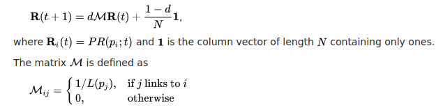
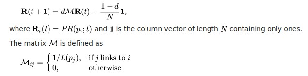

# Text Summarization

Text summarization can broadly be divided into two categories — **Extractive Summarization** and **Abstractive Summarization**.

#### Extractive Summarization

Extract several phrases and sentences from text and stack them together to create a summary.

#### Abstractive Summarization

 Use advanced NLP techniques to generate new sentences from the original text and create the summary. The sentences generated might not be present in the original text.

#### Extractive Summarization Algorithms

##### TextRank

TextRank is an algorithm based on PageRank, which often used in keyword extraction and text summarization. Here ranking will be done on sentences instead of web pages. The matrix M would be similarity matrix between sentences. You can use any vectorization to get the vector of sentences.

###### PageRank

PageRank is an algorithm used to calculate the weight for web pages. We can take all web pages as a big directed graph. In the graph, a node is a web page and the link from  web page A to web page B is represented as a directed edge from A to B. The underlying assumption is that more important websites are likely to receive more links from other websites.

Algorithm - 

At t=0, an initial probability distribution is assumed 

where N is the total number of pages.

At each time step,

where d is the damping factor (usually 0.85),  is the set of pages that link to pi and  is the number of outbound links on page.

Assumption - 

Link the a web page with no outbound link to all pages.

Iterate until convergence - page rank does not seem to change.

In the matrix notation -

